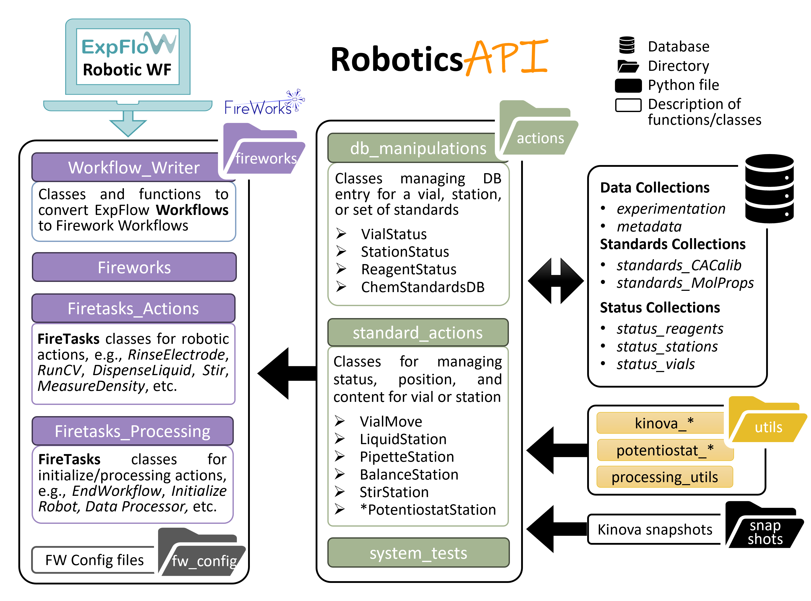

# RoboticsUI
This repo contains a user interface for the RiskoRobot at CAER.

## Installations
### Create Environment
The primary package this repo requires is the [D<sup>3</sup>TaLES API](https://github.com/D3TaLES/d3tales_api). 
It is recommended that you create an environment to host the required packages. 
```bash
conda create --name d3tales_robotics
conda activate d3tales_robotics
conda install -c conda-forge fireworks
pip install git+https://github.com/d3tales/d3tales_api.git
```

### Activate Environment
Note that you must set the `DB_INFO_FILE` environment variable as stipulated in the
[D<sup>3</sup>TaLES API Docs](https://github.com/D3TaLES/d3tales_api).You will also
need to set the fireworks variable `FW_CONFIG_FILE` and a `PYTHONPATH`. For robotics PC (WINDOWS), 
set environment variables: 
```bash
conda activate d3tales_robotics
$env:PYTHONPATH='C:\Users\Lab\D3talesRobotics\roboticsUI;C:\Users\Lab\D3talesRobotics\Packages\d3tales_api;C:\Users\Lab\D3talesRobotics\Packages\hardpotato\src'
$env:FW_CONFIG_FILE='C:\Users\Lab\D3talesRobotics\roboticsUI\robotics_api\management\config\FW_config.yaml'
$env:DB_INFO_FILE='C:\Users\Lab\D3talesRobotics\roboticsUI\db_infos.json'
cd C:\Users\Lab\D3talesRobotics\launch_dir
```

## QuickStart

### Creating Robotic Workflows: ExpFlow
All robotic workflows are created from ExpFlow Robotic Workflows. [ExpFlow](https://d3tales.as.uky.edu/expflow/)
is a D3TaLES tool that allows researchers to systematically encode their
experimental procedures through an intuitive graphical interface. For more information see the 
[ExpFlow Documentation](https://d3tales.as.uky.edu/expflow/docs)

A user may create an ExpFlow Template, then use that template to generate an ExpFlow Robotic Workflow.
This Robotic Workflow can then be downloaded as a JSON file to the Robotics Workstation. (It is recommended that you 
store downloaded workflows in the `downloaded_wfs` folder.) A downloaded Robotic Workflow JSON file may be loaded 
and readied for robotic action through the `D3TaLES Robotics` app.

### Managing Robotic Workflows
The robotic workflows are managed via [FireWorks](https://materialsproject.github.io/fireworks/). If you are not 
familiar with Fireworks, it is highly recommended that you review the structure of FireWorks to 
better understand this system. Many operations to manage your robotic workflows can be implemented directily
via the FireWorks `lpad` and `rlaunch` commands. 

Additionally, the robotic system can be managed via the `D3TaLES Robotics` app.
This can be launched from the icon Robotics Workstation desktop page.  


### Running an Experiment...
* Load Robotics Workflow
  * Create Robotics Workflow on [ExpFlow](https://d3tales.as.uky.edu/expflow/)
  * Download Robotics Workflow file
  * Load Robotics Workflow file through `Add Job` on robotics desktop app (select experiment and reagent locations as prompted)
     > **Note for Measuring Conductivity**: Be sure to create, load, and run a CA Calibration workflow at least once 
     > on a day when you run conductivity experiments. 
* Turn on: 
  * The robot
  * All Arduino devices 
  * Liquid dispensing pumps
  * Instruments 
  * Balance
  * Stir plate (turn the rotation rate to desired value)
* Prepare materials: 
  * Measure and dispense solids
  * Bubble argon in solvent 
  * Fill rinsing vials
* Prepare Stations
  * Flush liquid dispensing tubes with 8 mL solution 
  * Set all electrodes
  * Set temperature probe
  * Set all vials
* Prepare Software
  * Launch Fireworks WebGUI (through command line or desktop app)
  * Ensure there is *only one* READY firework: the `init_` firework for the workflow you'd like to run. 
     >**Important!** *Only one* workflow may be initiated at a time. To ensure no other workflows accidentally 
     > run, make sure all other workflows are PAUSED, DEFUSED, or COMPLETED. 
* Start Experiment
  * Start instrument jobs. Through the desktop app, select `Run Instruments` -> `Run Jobs Continuously`
  * Start processing jobs. Through the desktop app, select `Run Process` -> `Run Jobs Continuously`
  * Start robot jobs. Through the desktop app, select `Run Robot` -> `Run Jobs Continuously`
  * Initialize workflow. Through the desktop app, select `Initialize Workflow` -> `Run a Job`

### Common Errors
* `NameError: Argument wflow_name does not match instance current_wflow_name`: You are trying to run a 
workflow that is not initiated. You are likely trying to run two workflows at once. Ensure all other 
workflows are COMPLETED, PAUSED, or DEFUSED, then rerun the `init_` firework from the workflow you 
are trying to run. 
* `ValueError: Conductivity calibration for today does not exist.`: You are trying to measure conductivity
(processing CA experiment files so trying to get the cell constant) when you have not run a CA 
calibration that day. Run a CA calibration every day you perform CA experiments. 
* 
* In general, **read error messages**! Error messages should explain what went wrong. You can
also use the traceback to find where in the code the error occurred. 


## RoboticsUI Modules
This repository contains several directories: 
* `_kbio`: Python API for the Kinova robot. These files are taken directly from the commercial 
[Kinova Python API](https://github.com/Kinovarobotics/Kinova-kortex2_Gen3_G3L). They should not be edited.
* `GUI`: Code for the robotics desktop app. Used Tkinter. 
* `robotics_api`: Robotics API that manages robotic workflows. (More discussion below.)
* `test_data`: Example, standard, and test experimental data

### Robotics API
The RoboticsAPI consists of four modules: 
* `actions`: Classes for managing status, position, and content for vials, stations, or standards. These
data are stored in MongoDB databases. 
* `fireworks`: Classes and functions for Fireworks Workflows, FireWorks, and FireTasks
* `utils`: Utility functions for robot movements, instrument interactions, processing, database interactions, etc. 
* `snapshots`: A directory containing Kinova snapshots (JSON files) for positions 
for the robot. Files named `<station_name>.json` give the position of the robot where
the vial sits directly in the station. Files named `pre_<station_name>.json` give the position 
the robot should be before/after moving to the station. Note that some snapshots give cartisian 
coordinates while other give actuator angle. 


