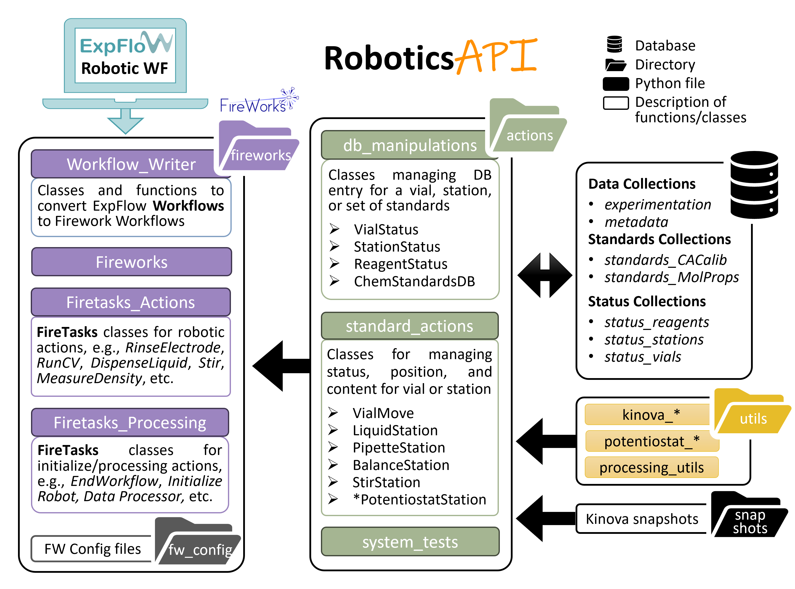

Welcome to the D\ :sup:`3`\ TaLES Robotics API documentation!
=============================================================

.. |D3TaLES| replace:: D\ :sup:`3`\ TaLES

The RoboticsAPI is designed to manage the D\ :sup:`3`\ TaLES robotics system. It consists of three modules, each of increasing abstraction:

- ``utils``: Utility functions for robot movements, instrument interactions, processing, database interactions, etc. This module offers the lowest level of abstraction.
- ``actions``: Classes for managing status, position, and content for vials, stations, or standards. These data are stored in MongoDB databases.
- ``fireworks``: With the highest level of abstraction, this module contains classes and functions for FireWorks Workflows, FireWorks, and FireTasks.

The RoboticsAPI also contains the following items:

- ``settings.py``: A single file with all adjustable settings for robotics operations. **Always review this file before operating the robotic system!**
- ``snapshots``: A directory containing Kinova snapshots (JSON files) for positions
  for the robot. Files named ``<station_name>.json`` give the position of the robot where
  the vial sits directly in the station. Files named ``pre_<station_name>.json`` give the position
  the robot should be before/after moving to the station. Note that some snapshots give Cartesian
  coordinates while others give actuator angles.

.. toctree::
   :maxdepth: 3
   :caption: Overview

   Installation
   Quickstart
   Robot Run Checklist
   Common Errors

.. toctree::
   :maxdepth: 1
   :caption: Modules and More

   Settings
   Fireworks
   Actions
   Databases
   Utils and Snapshots

.. toctree::
   :maxdepth: 1
   :caption: Detailed Code Docs

   robotics_api

Indices and tables
==================

* :ref:`genindex`
* :ref:`modindex`
* :ref:`search`
