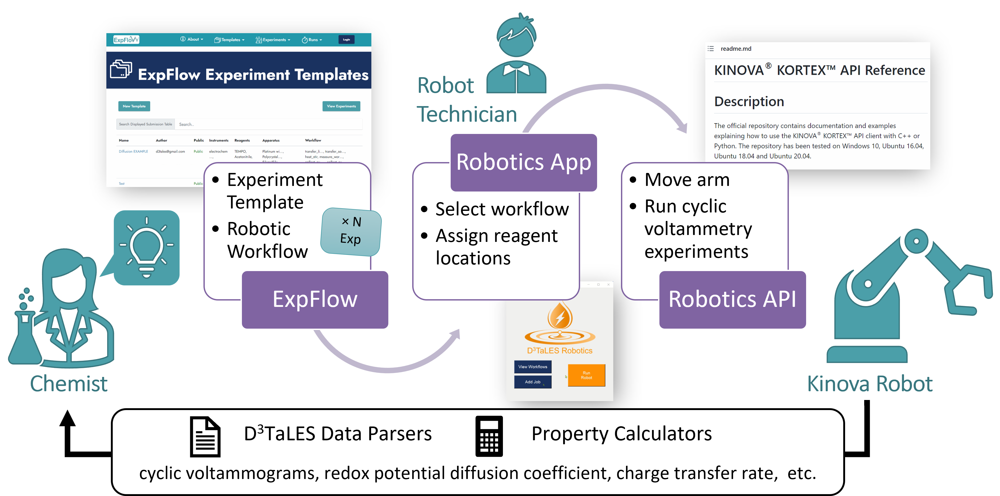

D\ :sup:`3`\ TaLES Robotics UI and API Documentation!
=================================================================

.. |D3TaLES| replace:: D\ :sup:`3`\ TaLES

Here you will find complete documentation for the |D3TaLES| robotics Python software
hosted in the `roboticsUI repository <https://github.com/D3TaLES/roboticsUI>` GitHub
repository. This includes documentation ExpFlow and Robotics Desktop App user
interfaces as well as the Robotics API for interacting with the robotics
hardware directly.

RoboticsUI Contents
===================

The `roboticsUI repository <https://github.com/D3TaLES/roboticsUI>` contains several directories:

- ``_kbio``: Python API for the Kinova robot. These files are taken directly from the commercial
   `Kinova Python API <https://github.com/Kinovarobotics/Kinova-kortex2_Gen3_G3L>`_. They should not be edited.
- ``GUI``: Code for the robotics desktop app. Used Tkinter.
- ``robotics_api``: Robotics API that manages robotic workflows. (More discussion below.)
- ``test_data``: Example, standard, and test experimental data.

.. toctree::
   :maxdepth: 3
   :caption: Overview

   Installation
   TerminologySetup
   Quickstart
   RobotRunChecklist
   CommonErrors

.. toctree::
   :maxdepth: 3
   :caption: User Interfaces

   ExpFlow
   DesktopApp

.. toctree::
   :maxdepth: 3
   :caption: API Modules and More

   Settings
   Fireworks
   Actions
   Databases
   UtilsSnapshots

.. toctree::
   :maxdepth: 3
   :caption: Detailed Code Docs

   robotics_api

Indices and tables
==================

* :ref:`genindex`
* :ref:`modindex`
* :ref:`search`
